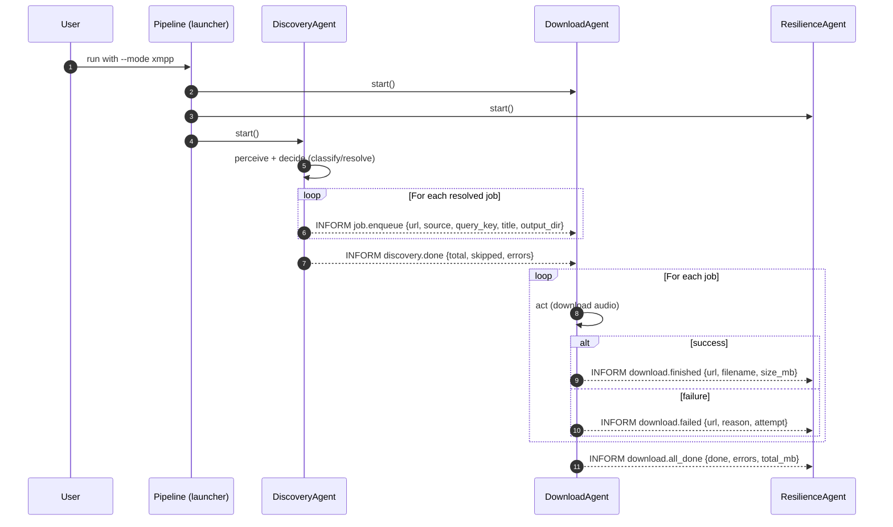
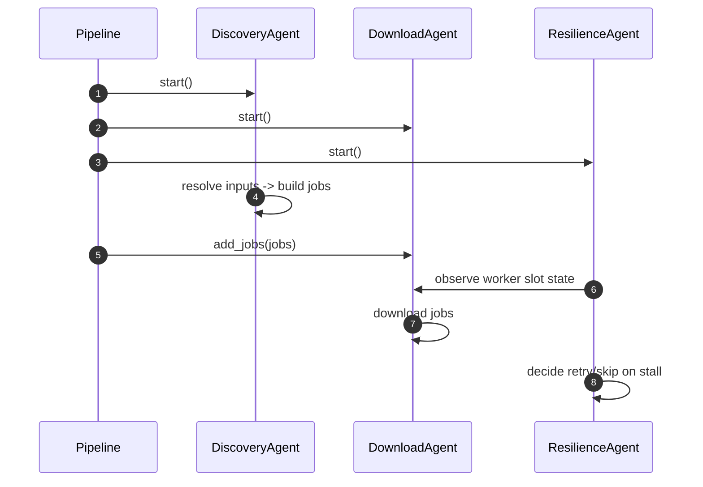

# Interaction Design (Phase 3)

This document describes message flows and message fields for the Ga-Audio-Harvester multi-agent system.

## Interaction Diagram (XMPP Mode)

## Interaction Diagram (Direct Mode)

## Message Fields (JSON Bodies)

Messages are JSON bodies with a `type` field. Types are centralized in `agents/shared/ontology.py`.

### Discovery -> Download

- `job.enqueue`
  - `type`: `"job.enqueue"`
  - `url`: string
  - `source`: `"search" | "channel" | "playlist" | "direct"`
  - `query_key`: string (original query or URL)
  - `title`: string (optional)
  - `output_dir`: string (suggested output directory)

- `discovery.done`
  - `type`: `"discovery.done"`
  - `total`: int
  - `skipped`: int
  - `errors`: int

### Download -> Resilience

- `download.finished`
  - `type`: `"download.finished"`
  - `url`: string
  - `filename`: string (best-effort label)
  - `size_mb`: int (best-effort estimate)

- `download.failed`
  - `type`: `"download.failed"`
  - `url`: string
  - `reason`: string
  - `attempt`: int

- `download.all_done`
  - `type`: `"download.all_done"`
  - `done`: int
  - `errors`: int
  - `total_mb`: int

